# Hummingbird Hammocks Mega Hammock Sewing

## Table of Contents

- [General info](#general-info)
- [Cutting](#cutting)
- [Pre-Build](#pre-build)
- [Hammock Construction](#hammock-construction)
- [Bag Construction](#bag-construction)
- [Finishing](#finishing)

## General Info

These instructions explain how to build a Hummingbird Hammocks Mega Hammock from start to finish. These instructions may be used, modified and redistributed in accordance with the Creative Commons Attribution-ShareAlike 4.0 International license

## Cutting

### Fabric

- 8’ x 60” Main Body Rectangles (x3)
- 1’ x 1’ Right Angle Triangle (x4)
- 13.5” x 36” Bag Rectangle

The main body of the hammock is comprised of three pieces of equal size. They should all be 8 foot long and 60 inches wide (fabric width.) It is not necessary to hot cut this fabric as the edges will be concealed and the fabric is coated to prevent unraveling. Additionally you will need 4 corner reinforcements that are right angle triangles with the two equal sides being 1 foot in length. The bag is made from a rectangle measuring 36 inches by 13.5 inches. If you cut a piece of fabric off the roll that is 13.5 inches long and the full fabric width you will have enough for all the corner reinforcements and the bag.

### Webbing/Tape

- 7’ 8” Type 12 Inside Seams (x2)
- 1.5’ ½” Radial Seam Tape (x4)
- 5.5” ½” Radial Seam Tape (x4)

For webbing you will need 2 pieces of Type 12 that are 7 foot 8 inches long, this will make them 2 inches short of the fabric width on both ends of the webbing to allow for the double hem around the edge of the hammock. For the edge of the hammock, you will need a piece that runs the full perimeter of the hammock with a 13 inch overlap where the webbing starts and stops in the edge. I typically recommend sewing this webbing off the roll and cutting it to length when you get to the end, if you must cut it before hand it should be about 46 foot long. The tape for the corner reinforcements is 4 pieces 1.5 foot long and 4 pieces 5.5 inches long. Again I
recommend sewing these off the roll and cutting them to length after they are sewn.

## Pre-Build

### Corner Reinforcements

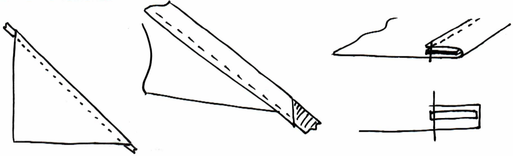

I’ve found it’s easier to prepare the corner reinforcements before beginning the hammock as a whole. Only one seam is needed to do this. A simple hem along the long side of the triangle with ½ inch radial seam tape inside. Sew to the inside of the tape to get a good hold on everything. Alternatively you could skip this step and do the hem with tape at the same time you sew it to the hammock, this would save a little time and would remove one seam from the corners (as you wouldn't have to double over it later to secure it to the hammock) but I have yet to find a good way to do that easily.

## Hammock Construction

### Combining The Three Body Pieces

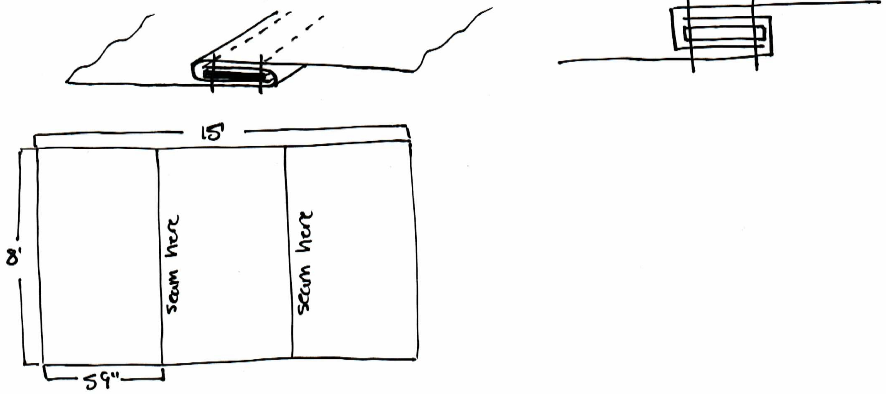

The three main body pieces of fabric are combined along the 8 foot edges to create one piece of fabric that is 8 foot by 15 foot. They are combined using a flat felled seam with Type 12 webbing inside. When placing the tape into the seam, it should run 2 inches short of either end, this leaves room for the double hem that will go around the edge of the hammock later. It is preferred to have the edge of the flat felled seam facing outward on the top the hammock on either side. (see example below)

### Attaching Corner Reinforcements

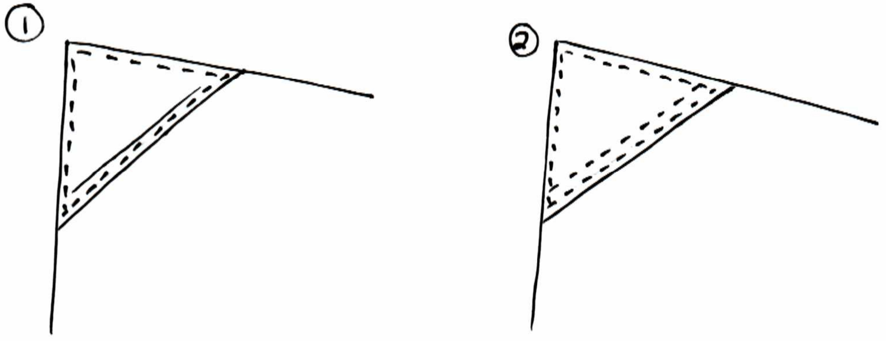

The corner reinforcements should be sewn on to the top side of the hammock over top of the corners. Stitch around the perimeter of the triangle and then stitch back over top of the seam used to make the hem with the tape earlier. This creates a double stitch on the long edge that already has tape inside on the corner reinforcement and secures the rest of the corner with a single stitch to keep it from moving.

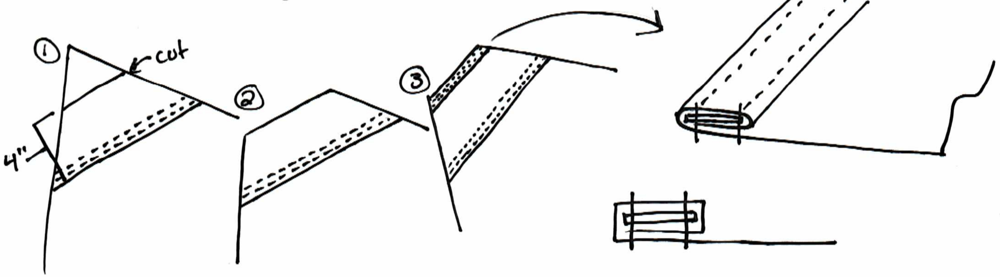

Next, measure 4 inches from the long edge of the triangle towards the corner of the hammock and draw a line parallel to the long edge of the triangle. Cut along this line. Now create a double hem along the edge you just cut by rolling the 5.5 inch piece of ½” radial seam tape inside of it. Double stitch this seam.

### Sewing The Hammock Edges

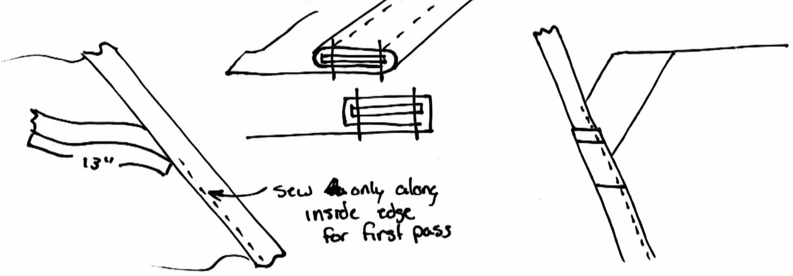

The edges of the hammock are sewn with a double hem that has Type 12 webbing inside. Start in the center of the hammock on one of the long sides, and leave a 13 inch tail on the Type 12 webbing to allow for the overlap needed to finish the edge later. The double hem will be rolled under the hammock, away from the side the corner reinforcements are on (this is important for load bearing characteristics) Fold the fabric around the webbing and sew on the inside edge of the webbing, continue until you get to the corner and sew all the way to the end of the hammock fabric.

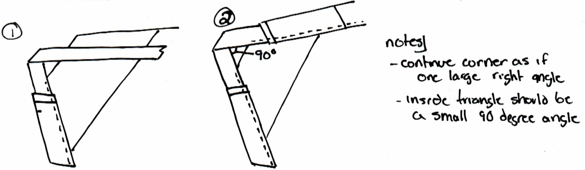

Allow the webbing to continue as if completing the corner of the rectangle that was cut off, then fold once counter clockwise and turn on a 90 degree angle back into the next edge of the hammock. Fold the webbing around the webbing again and continue along the next edge as before. Repeat these steps for all 4 corners.

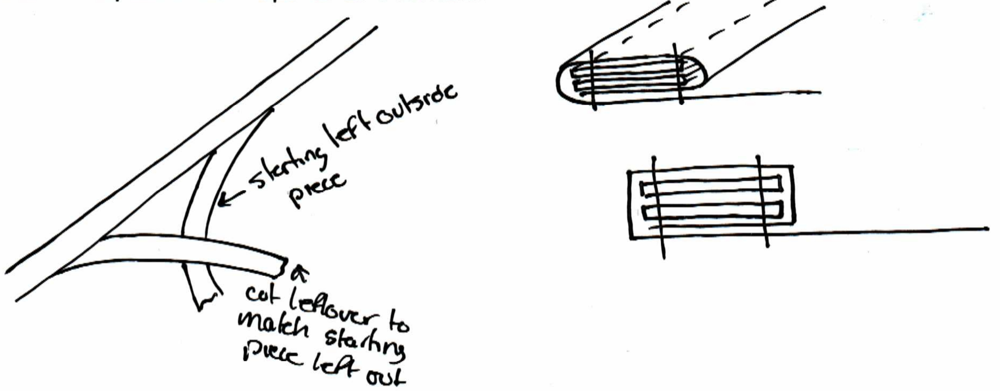

When you get to where you started, cut the webbing to the length needed for it to reach where you started sewing in the beginning, overlap the webbing where the 13 inch tail was left and sew them together inside the double hem. This hides the webbing tail and makes it a behave as one large loop of webbing. Now sew along the outside edge of the entire hammock to create a double stitch along the edge, using the same instructions as before however this time you do not need to do anything with the webbing as it is already secured in the hammock.

### Bartacking

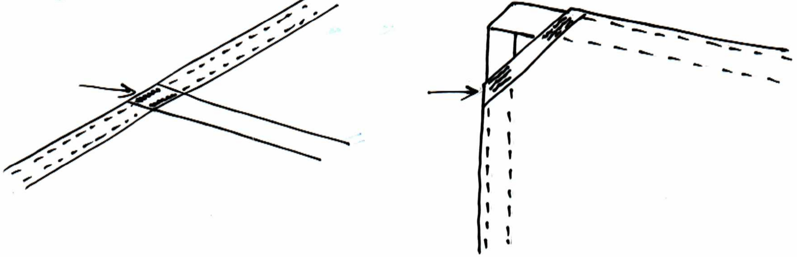

The final step for the hammock itself is to bartack. There should be two bartacks over top of the stitching at the points where the webbing from the inside seams overlaps the edge seam. There should also be six bartacks on each corner, three on each side of the corner where the double hem containing the ½” radial seam tape overlaps the webbing just before the webbing leaves the hammock fabric. These bartacks in the corners are critical to the design, it will absolutely fail without them.

## Bag Construction

### Overlocking

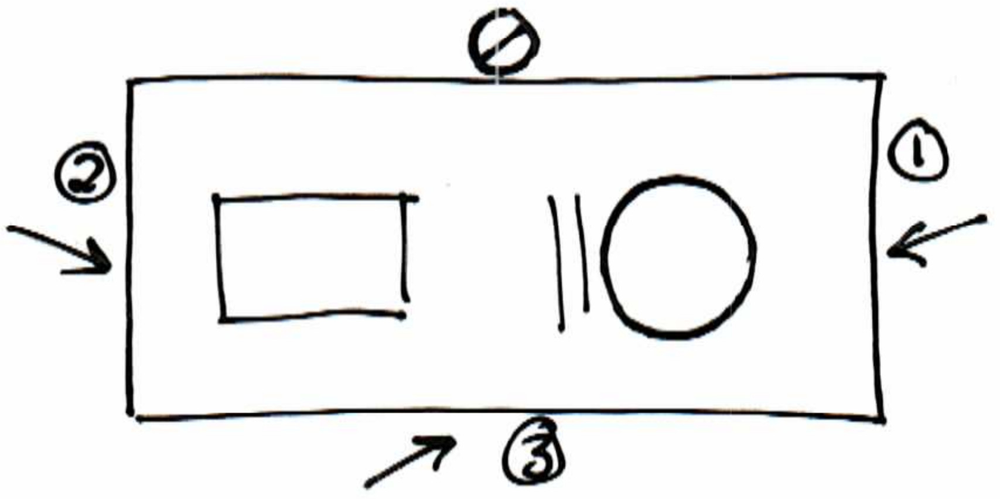

Run an overlock stitch across the two short sides of the bag as well as the right hand side of the bag when looking at the logo right side up.

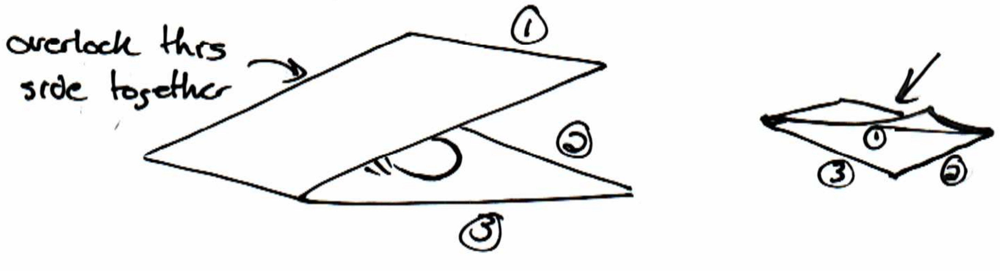

Fold the bag in half inside out (logo and warning label facing inside) and stitch the side of the bag together along the left side (the side not overlocked yet) to create one side of the bag.

### Bag Finishing

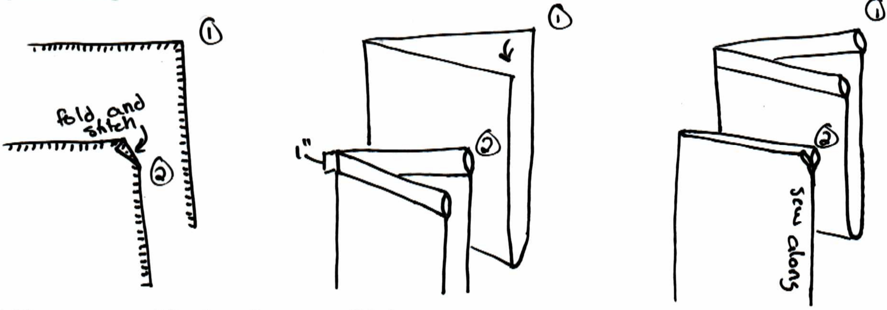

Fold the corners of the bag that are still left toward the inside of the bag on a slight angle and sew them down to create a pleasing opening for the drawstring channel. Now sew the drawstring channel by folding the top edge in 1 inch toward the bottom of the bag and sew it down along the entire length. Finally finish the bag by sewing the open side together.

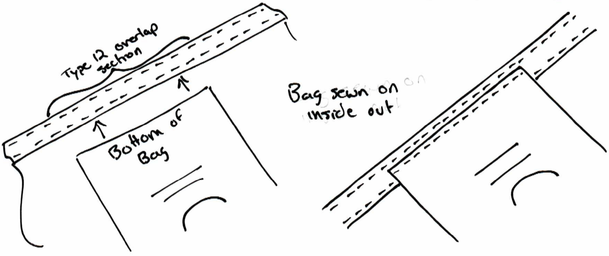

The bag can now be attached to the hammock by sewing it along the bottom edge of the bag to the 13 inch section of the hammock where the webbing overlap is. If the overlap is correct and the bag is the right size they should line up well. This attaches the bag and adds additional strength to the webbing overlap section.

## Finishing

Put a drawstring in the channel in the bag and attach a cordlock to it. The hammock is now finished and can be packed into its bag.
